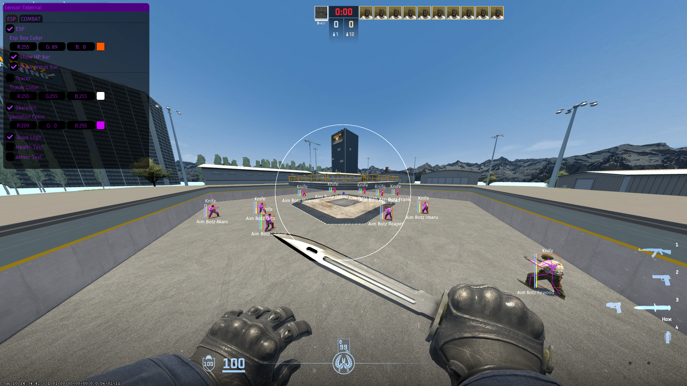

<h1 align="center">🐍 Lensor External Cheat</h1>

<h3 align="center">📸 Showcase</h3>

  
  

  

<h3 align="center">📜 Features</h3>

- ESP (Box, Tracers, Skeletons, Health Bar) with custom colors
- AimBot (smooth settings)
- Anti-flash  
- Custom FOV
- Screen Resolution

<h3 align="center">✨ Installation Steps</h3>

  - Download the latest release from [Releases](https://github.com/stoptoop/CS2-External-Cheat/releases).  
  - Extract and open the latest release.  
  - Start CS2.  

<h3 align="center">✨ Source Code Setup</h3>

  - Download and install Python 3.11 from [here](https://www.python.org/downloads/release/python-3110/).  
  - Install required libraries by running in your terminal: `pymem pywin32 imgui[glfw] pynput glfw PyOpenGL requests keyboard`
  - Run `main.py`

